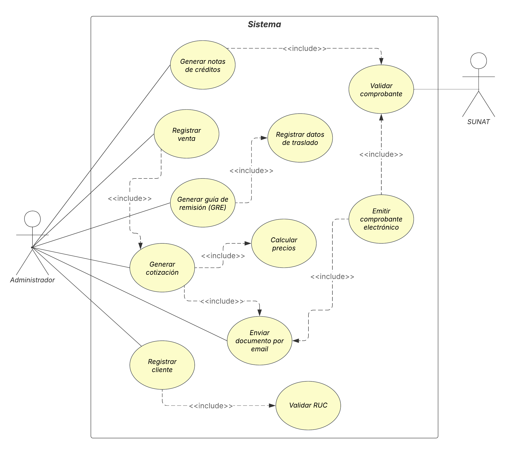

## Diagrama de casos de uso

---

## CU-01: Validar RUC

| Campo | Descripción |
|-------|-------------|
| **Título** | Caso de uso: Validar RUC |
| **ID** | CU-01 |
| **Descripción** | Verifica que el RUC del cliente tenga 11 dígitos y sea único en el sistema. |
| **Actor** | Sistema (automático) |
| **Precondición** | Se ha ingresado un RUC para validar. |
| **Poscondición** | El RUC es validado como correcto o rechazado. |
| **Flujo Principal** | 1. Sistema recibe el RUC ingresado 2. Sistema verifica que tenga 11 dígitos 3. Sistema verifica que no exista previamente en el sistema 4. Sistema retorna resultado de validación |
| **Reglas de Negocio** | **RN01:** El RUC debe tener exactamente 11 dígitos **RN02:** El RUC debe ser único (no duplicado) |

---

## CU-02: Registrar cliente

| Campo | Descripción |
|-------|-------------|
| **Título** | Caso de uso: Registrar cliente |
| **ID** | CU-02 |
| **Descripción** | Registra un nuevo cliente en el sistema con sus datos obligatorios. |
| **Actor** | Administrador |
| **Precondición** | El cliente no existe previamente en el sistema. |
| **Poscondición** | Cliente registrado en el sistema. |
| **Flujo Principal** | 1. Administrador ingresa RUC del cliente 2. Sistema valida RUC (incluye CU-01) 3. Administrador ingresa razón social 4. Administrador ingresa datos personales 5. Sistema almacena el cliente 6. Sistema confirma registro exitoso |
| **Reglas de Negocio** | **RN01:** RUC obligatorio de 11 dígitos **RN02:** RUC debe ser único **RN03:** Razón social es obligatoria **RN04:** Datos personales son obligatorios |

---

## CU-03: Registrar venta

| Campo | Descripción |
|-------|-------------|
| **Título** | Caso de uso: Registrar venta |
| **ID** | CU-03 |
| **Descripción** | Registra una venta aprobada por el cliente en el sistema. |
| **Actor** | Administrador |
| **Precondición** | Existe una cotización aprobada por el cliente El cliente está registrado en el sistema |
| **Poscondición** | Venta registrada y lista para emitir comprobante. |
| **Flujo Principal** | 1. Administrador selecciona cotización aprobada 2. Administrador ingresa datos de la venta 3. Sistema genera número de orden de compra. 4. Sistema almacena la venta 5. Sistema confirma registro exitoso |
| **Reglas de Negocio** | **RN05:** Debe existir una cotización previa **RN06:** La venta debe estar asociada a un cliente registrado **RN07:** Se genera automáticamente un número de orden de compra.|

---

## CU-04: Emitir comprobante electrónico

| Campo | Descripción |
|-------|-------------|
| **Título** | Caso de uso: Emitir comprobante electrónico |
| **ID** | CU-04 |
| **Descripción** | Genera un comprobante electrónico (factura, boleta, nota) en formato XML y PDF. |
| **Actor** | Administrador |
| **Precondición** | Existe una venta registrada (CU-03). |
| **Poscondición** | Comprobante generado en XML y PDF Comprobante validado por SUNAT Comprobante enviado al cliente por email |
| **Flujo Principal** | 1. Administrador selecciona venta a facturar 2. Administrador selecciona tipo de comprobante (factura/boleta) 3. Sistema genera archivo XML del comprobante 4. Sistema genera archivo PDF con código QR. 5. Sistema valida comprobante con SUNAT (incluye CU-08) 6. Sistema almacena comprobante 7. Sistema envía comprobante por email al cliente.(incluye CU-11) |
| **Reglas de Negocio** | **RN08:** Debe incluir código QR **RN09:** Debe incluir logo de la empresa **RN10:** Debe incluir datos obligatorios de SUNAT **RN11:** Debe validarse con SUNAT antes de ser válido **RN12:** Se debe enviar automáticamente por email al cliente |

---

## CU-05: Generar guía de remisión

| Campo | Descripción |
|-------|-------------|
| **Título** | Caso de uso: Generar Guía de Remisión Electrónica |
| **ID** | CU-05 |
| **Descripción** | Genera una guía de remisión electrónica asociada a una orden de compra. |
| **Actor** | Administrador |
| **Precondición** | Existe una venta registrada Existen datos de traslado registrados |
| **Poscondición** | GRE generada y almacenada en el sistema. |
| **Flujo Principal** | 1. Administrador selecciona orden de compra 2. Sistema registra datos de traslado (incluye CU-07) 3. Sistema genera GRE en formato XML y PDF 4. Sistema asocia GRE con número de orden de compra 5. Sistema almacena GRE 6. Sistema confirma generación exitosa |
| **Reglas de Negocio** | **RN13:** Debe estar asociada a una orden de compra **RN14:** Debe incluir origen y destino **RN15:** Debe incluir fecha de traslado **RN16:** Debe incluir datos del vehículo y placa **RN17:** Debe incluir nombre y DNI del conductor **RN18:** Debe incluir peso y volumen de la carga |

---

## CU-06: Calcular precios

| Campo | Descripción |
|-------|-------------|
| **Título** | Caso de uso: Calcular precios |
| **ID** | CU-06 |
| **Descripción** | Calcula el precio con o sin IGV según selección del usuario. |
| **Actor** | Sistema (automático) |
| **Precondición** | Se ha seleccionado un producto o servicio con precio base, previamente cotizado. |
| **Poscondición** | Precios calculados y mostrados. |
| **Flujo Principal** | 1. Sistema recibe precio base 2. Sistema verifica selección del usuario (con/sin IGV) 3. Si "con IGV": Sistema calcula PrecioConIGV = PrecioBase × 1.18 4. Si "sin IGV": Sistema muestra PrecioSinIGV = PrecioBase 5. Sistema retorna precio calculado |
| **Reglas de Negocio** | **RN19:** IGV es 18% **RN20:** Fórmula con IGV: PrecioBase × 1.18 **RN21:** Fórmula sin IGV: PrecioBase |

---

## CU-07: Registrar datos de traslado

| Campo | Descripción |
|-------|-------------|
| **Título** | Caso de uso: Registrar datos de traslado |
| **ID** | CU-07 |
| **Descripción** | Registra la información logística necesaria para el traslado de mercadería. |
| **Actor** | Administrador |
| **Precondición** | Existe una venta que requiere despacho. |
| **Poscondición** | Datos de traslado almacenados en el sistema. |
| **Flujo Principal** | 1. Administrador ingresa dirección de origen 2. Administrador ingresa dirección de destino 3. Administrador ingresa datos del vehículo y placa 4. Administrador ingresa nombre del conductor 5. Administrador ingresa DNI del conductor 6. Administrador ingresa peso de la carga 7. Administrador ingresa volumen de la carga 8. Sistema almacena datos de traslado 9. Sistema confirma registro exitoso |
| **Reglas de Negocio** | **RN22:** Origen y destino son obligatorios **RN23:** Placa del vehículo es obligatoria **RN24:** Nombre y DNI del conductor son obligatorios **RN25:** Peso y volumen son obligatorios |

---

## CU-08: Validar comprobante

| Campo | Descripción |
|-------|-------------|
| **Título** | Caso de uso: Validar comprobante con SUNAT |
| **ID** | CU-08 |
| **Descripción** | Envía el comprobante electrónico a SUNAT para su validación y recibe el CDR. |
| **Actor** | SUNAT (sistema externo) |
| **Precondición** | Comprobante electrónico generado en formato XML. |
| **Poscondición** | CDR recibido de SUNAT Comprobante marcado como aceptado o rechazado |
| **Flujo Principal** | 1. Sistema envía XML del comprobante a SUNAT 2. SUNAT valida estructura del XML 3. SUNAT verifica datos obligatorios 4. SUNAT valida RUC del emisor 5. SUNAT genera CDR (aceptación o rechazo) 6. Sistema recibe CDR de SUNAT 7. Sistema almacena CDR 8. Sistema actualiza estado del comprobante |
| **Reglas de Negocio** | **RN26:** Todo comprobante debe validarse con SUNAT **RN27:** Se debe almacenar el CDR (aceptación o rechazo) **RN28:** Si es rechazado, se debe corregir y reenviar |

---

## CU-09: Generar cotización

| Campo | Descripción |
|-------|-------------|
| **Título** | Caso de uso: Generar cotización |
| **ID** | CU-09 |
| **Descripción** | Genera una cotización numerada con los datos del cliente y productos solicitados. |
| **Actor** | Administrador |
| **Precondición** | Cliente registrado en el sistema. |
| **Poscondición** | Cotización generada y almacenada Cotización enviada al cliente por email |
| **Flujo Principal** | 1. Administrador selecciona cliente 2. Sistema genera número correlativo de cotización 3. Administrador ingresa productos/servicios 4. Sistema calcula precios (incluye CU-06) 5. Administrador selecciona condiciones de pago 6. Administrador ingresa vigencia de la cotización 7. Sistema genera PDF de cotización 8. Sistema almacena cotización 9. Sistema envía cotización por email (incluye CU-11) |
| **Reglas de Negocio** | **RN29:** Número de cotización es correlativo automático **RN30:** Fórmula: NroCotización = NroCotizaciónAnterior + 1 **RN31:** Debe incluir nombre, RUC del cliente **RN32:** Debe incluir montos, IGV, condiciones de pago **RN33:** Debe incluir vigencia y datos de contacto **RN34:** Fecha actual se asigna automáticamente |

---

## CU-10: Generar notas de créditos

| Campo | Descripción |
|-------|-------------|
| **Título** | Caso de uso: Generar notas de créditos |
| **ID** | CU-10 |
| **Descripción** | Genera una nota de crédito para corregir o ajustar un comprobante previamente emitido. |
| **Actor** | Administrador |
| **Precondición** | Existe un comprobante electrónico emitido Cliente ha solicitado ajuste o corrección |
| **Poscondición** | Nota de crédito generada y validada Generación de un nuevo comprobante de pago |
| **Flujo Principal** | 1. Administrador selecciona comprobante a corregir 2. Administrador ingresa motivo de la nota de crédito 3. Administrador ingresa montos u otros datos a ajustar 4. Sistema genera nota de crédito en XML y PDF 5. Sistema valida con SUNAT (incluye CU-08) 6. Sistema almacena nota de crédito 7. Sistema asocia con comprobante original 8. Sistema confirma generación exitosa |
| **Reglas de Negocio** | **RN35:** Debe estar asociada a un comprobante original **RN36:** Debe incluir motivo de emisión **RN37:** Debe validarse con SUNAT **RN38:** Solo se genera cuando el cliente reporta errores |

---

## CU-11: Enviar documento por email

| Campo | Descripción |
|-------|-------------|
| **Título** | Caso de uso: Enviar documento por email |
| **ID** | CU-11 |
| **Descripción** | Envía documentos electrónicos (cotizaciones, comprobantes) al cliente por correo. |
| **Actor** | Sistema (automático) |
| **Precondición** | Documento generado (cotización o comprobante) Cliente tiene email registrado |
| **Poscondición** | Documento enviado al email del cliente. |
| **Flujo Principal** | 1. Sistema obtiene email del cliente 2. Sistema adjunta documento PDF 3. Sistema genera cuerpo del email 4. Sistema envía email al cliente 5. Sistema registra envío exitoso |
| **Reglas de Negocio** | **RN39:** El cliente debe tener email registrado **RN40:** Se envía automáticamente tras generar cotización **RN41:** Se envía automáticamente tras emitir comprobante **RN42:** Se adjunta el documento en formato PDF |

---

Diagramas y documentación de cada uno de los casos de uso. Con respecto a la documentación de los casos de uso, incluirán lo siguiente:
- Además de los datos del encabezado del CU, incluirán flujo principal y reglas de negocio como mínimo.
- Usar la herramienta gráfica de su preferencia
- Mantener la notación UML de los casos de uso (relaciones include y exclude)
- Subir las imagenes en formato .png, .jpg.
- Resolución de 300 dpi para cada imagen.
