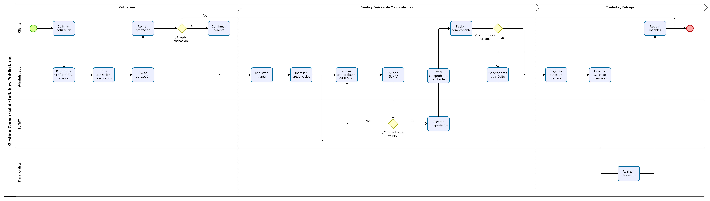
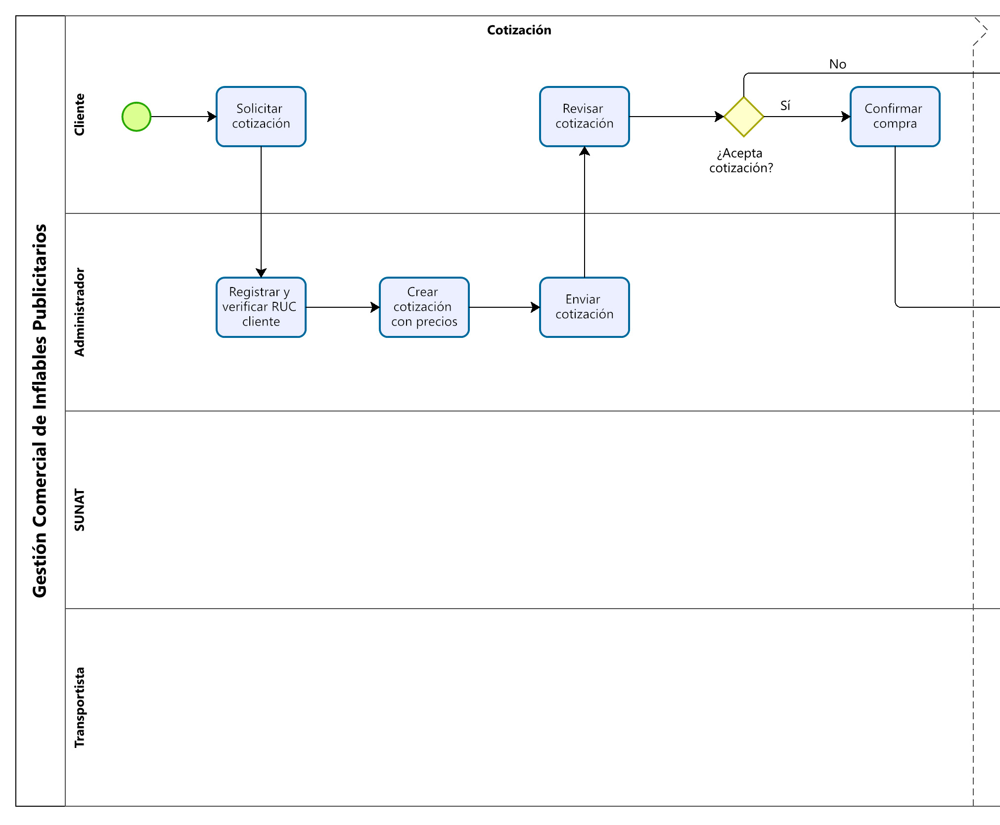
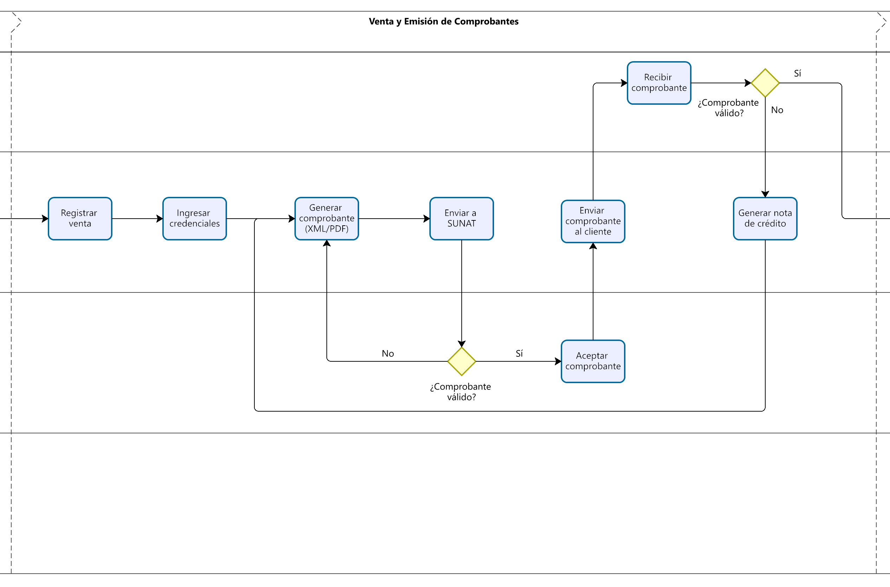
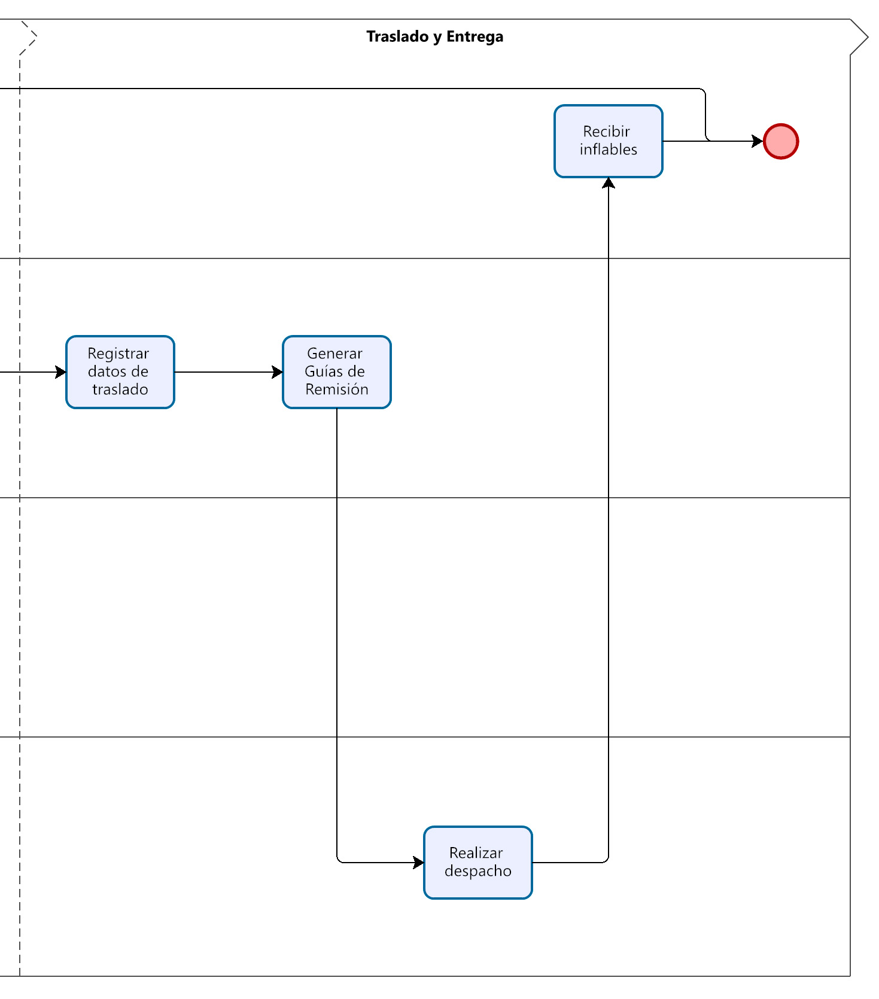

## Diagrama de procesos

A continuación, se presenta el Diagrama de procesos que describen el flujo operativo del sistema en los procesos de cotización, venta y facturación, y transporte. Estos diagramas permiten visualizar de forma clara la secuencia de actividades y la interacción entre los distintos actores involucrados en cada proceso.

