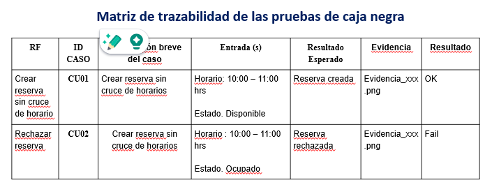

## Pruebas de caja negra

Deberán considerar una prueba de caja negra por cada requisito mandatorio (las otras pruebas son opcionales). Para ello deberá considerar:

- Como evidencias deberá incluir las capturas de pantalla o los logs del sistema.
- El formato a usar para la matriz de trazabilidad de las pruebas realizadas será el siguiente:

- En caso, haya alguna observación en algunas de las filas, podrá indicarlo fuera de la tabla como texto descriptivo de la observación con el fin de no saturar el contenido de la matriz de trazabilidad.

 
