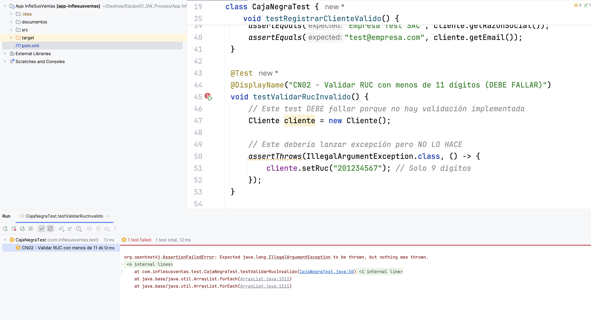

# Reporte de errores

El detalle de los errores encontrados serán indicados en el Anexo 2 - "Informe de errores encontrados":

## Anexo 2: "Informe de errores encontrados"

---

### Defecto DEF-001

**ID Defecto:** DEF-001

**Descripción del defecto:**  
La clase `Cliente` no valida que el RUC tenga exactamente 11 dígitos. Permite establecer valores de RUC con cualquier cantidad de caracteres sin lanzar ninguna excepción.

**Pasos - Pasos detallados junto con capturas de pantalla que evidencien los defectos encontrados:**
1. Crear una instancia de la clase `Cliente` usando el constructor vacío
2. Llamar al método `setRuc("201234567")` con un RUC de solo 9 dígitos
3. Observar que el método NO lanza ninguna excepción
4. El RUC inválido queda almacenado en el objeto sin validación

**Captura de pantalla:**  


**Código de prueba que detectó el error:**
```java
@Test
@DisplayName("CN02 - Validar RUC con menos de 11 dígitos (DEBE FALLAR)")
void testValidarRucInvalido() {
    Cliente cliente = new Cliente();
    
    // Este debería lanzar excepción pero NO LO HACE
    assertThrows(IllegalArgumentException.class, () -> {
        cliente.setRuc("201234567"); // Solo 9 dígitos
    }, "Debería lanzar excepción con RUC inválido");
}
```

**Fecha del defecto:** 2025-01-15

**Detectado por (Tester):** Clisman

**Estado del defecto:** Abierto

**Corregido por:** 

**Fecha de cierre:** 

**Prioridad:** Alta

**Impacto:**  
Afecta el Requisito Funcional RF1 (Registro de clientes). Permite el registro de clientes con RUC inválido, violando las reglas de negocio establecidas que requieren que todo RUC tenga exactamente 11 dígitos.

---

### Defecto DEF-002

**ID Defecto:** DEF-002

**Descripción del defecto:**  
El constructor de la clase `ProductoCotizacion` tiene parámetros en orden incorrecto. El cuarto parámetro duplica el valor de `codigo` en lugar de recibir `unidadMedida`, lo que causa que la unidad de medida nunca se asigne correctamente.

**Pasos - Pasos detallados junto con capturas de pantalla que evidencien los defectos encontrados:**
1. Abrir el archivo `ProductoCotizacion.java` línea 20
2. Revisar el constructor con parámetros
3. Observar que el cuarto parámetro está definido como `String unidadMedida`
4. Sin embargo, en línea 24 se ejecuta: `this.unidadMedida = unidadMedida;`
5. Pero en `CotizacionController.java` línea 20, el constructor se llama incorrectamente:
```java
   new ProductoCotizacion(codigo, descripcion, cantidad, codigo, precioBase)
   //                                                     ^^^^^^
   // Está pasando "codigo" dos veces en vez de "unidadMedida"
```

**Código problemático en CotizacionController.java (línea 38-39):**
```java
ProductoCotizacion producto = new ProductoCotizacion(
    codigo, descripcion, cantidad, codigo, precioUnitario);
    //                             ^^^^^^ ERROR: debería ser "unidadMedida"
```

**Solución esperada:**
```java
ProductoCotizacion producto = new ProductoCotizacion(
    codigo, descripcion, cantidad, unidadMedida, precioUnitario);
```

**Fecha del defecto:** 2025-01-15

**Detectado por (Tester):** Clisman

**Estado del defecto:** Abierto

**Corregido por:** -

**Fecha de cierre:** -

**Prioridad:** Crítica

**Impacto:**  
Afecta gravemente el Requisito Funcional RF2 (Generación de cotizaciones). Impide que los productos se creen correctamente con su unidad de medida. Todos los productos tendrán el código duplicado en lugar de la unidad de medida (UND, KG, etc.), lo que genera documentos PDF incorrectos.

---

## Resumen de defectos

| ID Defecto | Descripción resumida | Prioridad | Estado | Módulo afectado |
|------------|---------------------|-----------|--------|-----------------|
| DEF-001 | Cliente no valida RUC de 11 dígitos | Alta | Abierto | com.inflesusventas.model.Cliente |
| DEF-002 | Constructor ProductoCotizacion con parámetros incorrectos | Crítica | Abierto | com.inflesusventas.controller.CotizacionController |

**Total de defectos encontrados:** 2  
**Defectos críticos:** 1  
**Defectos de alta prioridad:** 1
